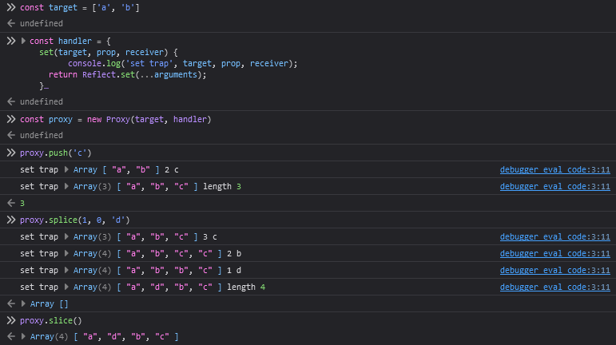

### Mixdeck design goals

1) **Reap the Mobx benefits while making the code more explicit.**
  
    Mobx is nice and all, and I have plenty of experience of writing some somewhat complicated stuff using Mobx. Tracking style of reactivity brings a *huge* benefit to React development in terms of web app performance. It's astonishing how much of a game changer it actually is.

    - Deep updates don't have to be propagated down the component tree, the only `observer` components to be re-rendered are ones that are actually tracking the changes.
    - You don't have to worry about a single missed memoization causing excessive component tree updates *that much*\*

    *\* in most cases. Sometimes you do actually have to still apply some optimizations, but this time those optimizations are Mobx flavour of React kind of specific, not React kind of specific.*

    So just by using Mobx in tandem with React you are boosting your web app's performance *and* eliminating *some* of developers' brain workload. Common sense dictates that, in most cases, less brain workload = more robust and less bug-prone code.

    However, you've just introduced another kind of brain workload for your developers (or yourself):

    - Aforementioned *Mobx flavour of React* performance optimizations. Stuff like passing observable selectors to a component's children instead of an actual observable, i.e. `prop={() => store.todoText}` instead of just `prop={store.todoText}`. While not strictly required (in a sense that, again, *in most cases* you'll probably be fine in terms of overall performance gains even with some of these optimization opportunities missed in your codebase), there are some cases where this could actually make a difference.
    - `observer` wraps, especially when using observables in custom react hooks. This is actually a pretty big deal: code using mobx isn't entirely clear on what's an observable and what's not. While some code would be a bit more clear on this (through the use of Mobx specific hooks such as `useLocalObservable` or perhaps your team's code conventions in a form of observable consumers or `useContext` wrappers that request some global store), this becomes an especially noticeable problem when you start passing observables around a bit more liberally in your code. Such would be a case with custom React hooks which are using observables, for example. While setting up a linter rule to wrap every single component in `observer` would solve this problem in its entirety (while introducing an overall negligible overhead), there are still cases of a) codebases in a process of transition to Mobx, b) codebases that contain some components and/or code designed to be consumed by some other pieces of non-Mobx-aware code, c) cases where it would be actually preferred to omit `observer` for explicitness' sake, e.g. components that may construct, hold or interact with observables with an explicit lack of intent to actually track the changes.
    - In some cases, the lack of explicitness might introduce some confusion when bridging observables and your non-React, non-observable code, such as application lifecycle management and transport layer facades.

    The #1 goal of Mixdeck is to attempt to find a remedy for the issues mentioned in above considerations. It should be clear to an outside observer what's actually trackable and observable, and what's a POJO, whether a piece of code in question is a React component, a composite store, or an OO-styled controller designed to incapsulate all of the complex business logic.

2) **When using React and Mixdeck, try to mimic `useState` as much as possible for all data reads.**

    Within the context of an ideal implementation that would mean that you're using extracted POJOs or primitives for all data reads and subsequent renders. This would ensure that an existing mental model of a React developer remains intact and can be easily applied to Mixdeck-React development:

    ```typescript
    const user = useTrack(store.user);

    // user is a POJO
    // the next line does nothing

    user.name = 'Alice';
    ```

    As for data writes, where in pure React a developer would use `setState`, a Mixdeck developer should use a predefined set of transactions.

3) **When using React and Mixdeck, eliminate the need to wrap your components in a HoC to make them observable-aware.**

    This, however, would require a system to explicitly track the state a developer might need in a component.

    The initial proposal to achieve this is an API that goes as follows:

    ```typescript
    // tracks changes to `user` Trackable, causes a re-render when a change is detected
    const user = useTrack(store.user);
    ```

    However, this poses a challenge in deduplicating/batching state updates in scenarios such as:

    ```typescript
    const user = useTrack(store.user);
    const token = useTrack(store.token);
    ```

4) **Provide a more lightweight solution to the set of problems Mobx is trying to solve.**

    60 KiB (minified) is a bit too much for a state management library.

5) **Provide transactionality to the actions.**

    This would allow building complex business logic flows that are more resilient to failure, allowing for state rollbacks. This would also lighten the developer load while also making it easier to catch errors higher in the call stack, allowing a more relaxed "expect things not to break" approach in development while still preserving consistency. Transaction isolation would also eliminate a lot of async data race cases.

6) **Provide an actual architectural scaffold for the daily problems an engineer might encounter.**

    Mobx is allowing a lot of freedom in how you use it, in fact, a bit to much. Mixdeck's idea is to limit the amount of freedom available to the developer for the sake of a) lessening the burden of choice, b) guiding the developer in the direction of a more robust, effective and performant code. However, this should be achieved not by forcing a developer upon some predestined 100% correct path, but rather by providing a general sense of direction on how things should be done.

    One of the design elements serving such purpose would be an entity system, which would encapsulate state, state-derived evaluations and transactions upon said state in a single abstraction, allowing for OO-like expressiveness while not resorting to classes as a very verbose solution that might potentially lead to an overly complex architecture.


### Random thoughts

```typescript
const state = trackableState({ counter: 0 });

state.counter.track((value) => console.log(`The counter is now ${value}`));

state.transaction((proxy) => proxy.counter++);

const eval = state.evaluation(({ counter }) => `${counter.toString} evaluation`);

evaluation.track((evaluatedValue) => console.log(evaluatedValue));

state.raw.counter;
```

Quick react primer:

```typescript
const CounterDisplay: React.FC = () => {
    const counterValue = useTrack(state.counter);

    return <div>{counterValue}</div>;
}
```

2 options for defining `state.track` behaviour in this example:

1. Unironically do nothing (use a map!)
2. Only track object shape changes i.e. key deletions/additions

Some yet unanswered questions:

1. Arrays of state objects: array insertion between two existing items should still trigger a re-render in a component that tracks the array
2. Composite state: say the `counter` field is actually not a primitive, but rather an object with structure `{ value: number }`. Then we use a transaction and completely replace this object to a different one, i.e. `state.counter = { value: /* some new value */ 7 }`. This should still trigger a re-render in a component that tracks `state.counter.value`.

Quick Array proxy demo used in this research:


So the approach of only notifying the tracking function of shape changes could definitely work, but some diffing logic should definitely be implemented on all ITrackable implementations, which could pose a performance impact.

### Some more sanity checks and thoughts

Given the following state:

```typescript
const state = trackableState([
    {
        id: 'someid1',
        todoText: 'Do something',
    },
]);
```

And these React components:

```typescript
const Todo: React.FC<{ todo: ITrackable<TodoState> }> = ({ todo }) => {
    const text = useTrack(todo.todoText);

    return <div>{text}</div>;
}

const TodoList: React.FC = () => {
    const todos = useTrack(state);

    return (
        <React.Fragment>
            {todos.map((todo, idx) => (
                <TodoView key={idx} todoState={todo} />
            ))}
        </React.Fragment>
    );
}
```

First off, let me begin by saying this is already is an anti-pattern since the `idx` key is used. But this also sheds light on some design shortcomings:

- This would not actually compile. By the current design `todos` returned from `useTrack` is actually a POJO, not an instance conferring to `ITrackable`.
- When I was writing this demo, I still had the strong urge to use it as if it was an instance of `ITrackable`.

The following code would be correct, but it's too convoluted and counter-intuitive:

```typescript
const TodoList: React.FC = () => {
    const todos = useTrack(state);

    return (
        <React.Fragment>
            {todos.map((_, idx) => (
                <TodoView key={idx} todoState={state[idx]} />
            ))}
        </React.Fragment>
    );
}
```

One could also refactor the whole state like in the following code snippet, which would result in an arguably better and more robust architecture, and most importantly in the context of this document, allow a developer to write ideomatic&trade; and sensible Mixdeck code:

```typescript
const state = trackableState({
    todoStorage: {
        'someid1': {
            id: 'someid1',
            todoText: 'Do something',
        },
    },
    displayOrder: ['someid1'],
});

const TodoList: React.FC = () => {
    const todosOrder = useTrack(state.displayOrder);

    return (
        <React.Fragment>
            {todosOrder.map((todoId) => (
                <TodoView
                    key={todoId}
                    todoIdFromStorage={todoId}
                />
            ))}
        </React.Fragment>
    );
}
```

So, this achieves the following:

- eliminates the "array index as a key" anti-pattern
- eliminates the possibility of a mix-up between a native type and `ITrackable`

However, if tracking on non-primitives behaviour is still defined as only reporting shape changes, this still would break on item swap in `todosOrder`.

